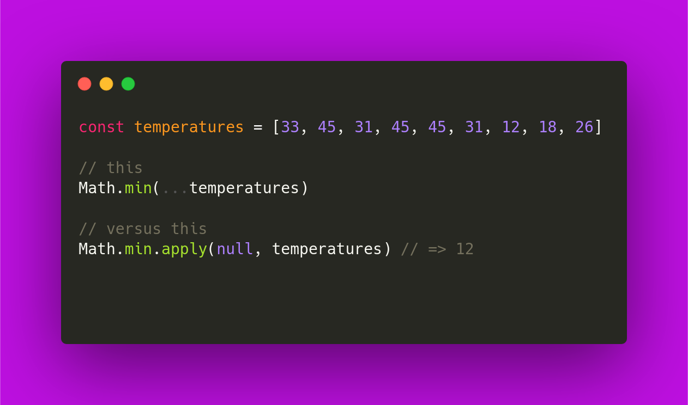

# :construction_worker_woman: Desctructuring

<TagLinks />

ES6 Feature

1. Object Destructuring
2. Array Destructuring
3. In Functions

> Convert bigger arrays or objects to smaller arrays and objects.
> Smaller workable chunks
> Or combining them

Using spread Operator

```js
const alphabets = ['A', 'B', 'C', 'D', 'E', 'F']
const numbers = [1, 2, 3, 4, 5, 6]

// old way
cons a = alphabet[0]
// ES6 way
const [a,, c, ...rest] = alphabet

// combining Lists
const combinedArray = [...alphabet, ...numbers]
const combinedArray = alphabet.concat(numbers)
```


## Desctructuring in Functions

- JS functions [Can not return multiple values](https://stackoverflow.com/questions/2917175/return-multiple-values-in-javascript), but we can use destructuring and return objects and arrays from functions.
- Set default values in javascript functions?

::: tip Factory Function
When objects have logic, the produces objects

```js
// factory function
function getValues() {
  return {
    first: getFirstValue(),
    second: getSecondValue(),
  };
}

const { first, second, third = "not defined" } = getValues();
```

:::



## Object Desctructuring

[Object Desctructuring](https://developer.mozilla.org/en-US/docs/Web/JavaScript/Reference/Operators/Destructuring_assignment)

> real power of destructuring

- [Merging Objects](https://stackoverflow.com/questions/13852852/how-do-i-merge-two-javascript-objects-together-in-es6)
  Useful when designing backend API responses
- very prevalent in react and other javascript frameweorks

```js
const someJson = {
  name: "avi",
  age: 30,
  address: {
    city: "somewhere",
    state: "who knows",
  },
};
const {
  name: firstName,
  address: { city },
  ...rest
} = someJson;

// combining Objects
const merged = { ...obj1, ...obj2 };
let result = { ...item, location: { ...response } };

// function Parameters
function printJson({ name, age, spouse = "none" }) {
  console.log(`Name is ${name}. Age is ${age}. Spouse ${spouse}`);
}
printJson(someJson);
```

### Destructuring on Function Parameters

<Footer />
