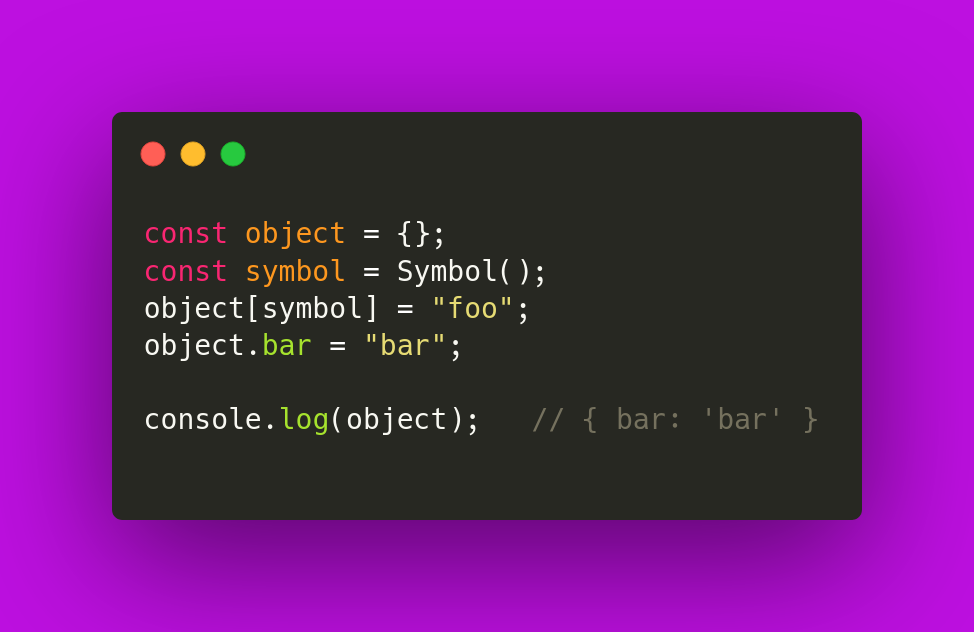

# Symbol and Bind

<TagLinks />



## Symbol

guaranteed to be unique.
Symbols are often used to add unique property keys to an object that won’t collide with keys any other code might add to the object,
and which are hidden from any mechanisms other code will typically use to access the object.
That enables a form of weak encapsulation, or a weak form of information hiding.

::: tip Symbols
Symbold are not returned in the result of `Object.keys()`

Used in download managers to manage multiple download sessions without conflict

:::

```js
const obj = {};
const sym = Symbol();
obj[sym] = "foo";
obj.bar = "bar";

console.log(obj); // { bar: 'bar' }
console.log(sym in obj); // true
console.log(obj[sym]); // foo
console.log(Object.keys(obj)); // ['bar']
```

[What is bind?](./interview-questions.md)

```js
var hero = {
  _name: "John Doe",
  getSecretIdentity: function() {
    return this._name;
  },
};
var stoleSecretIdentity = hero.getSecretIdentity.bind(hero);

console.log(stoleSecretIdentity());
console.log(hero.getSecretIdentity());
```

<Footer />
