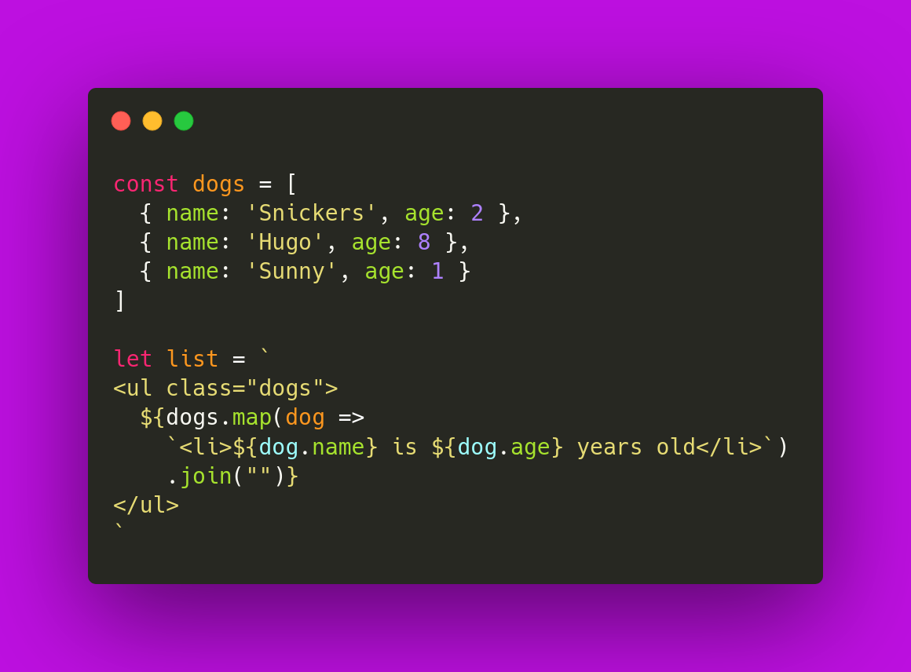
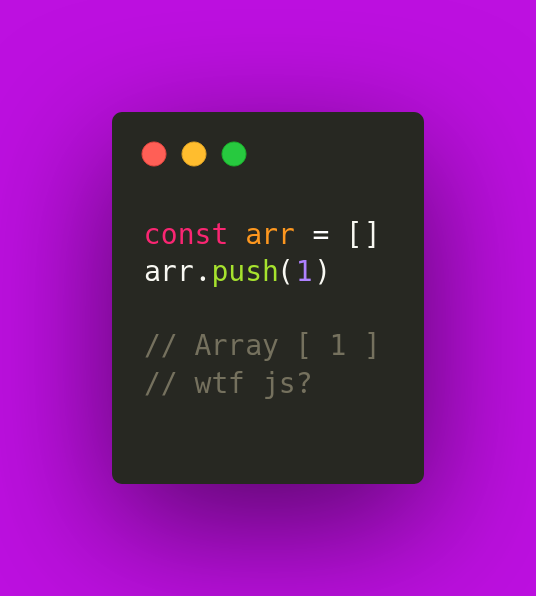

# Syntax

<TagLinks />

## Loop

| loop syntax                    | description                                |
| ------------------------------ | ------------------------------------------ |
| `for ... in`                   | loop through objects                       |
| `for ... of` <br> `.forEach()` | loop through array                         |
| `[1,2].map(n => n+1)`          | Array Methods, run a fn on each array item |

- Asynchronous Programming - Non deterministic programming
- In JavaScript, a variable can be declared after it has been used. **Hoisting**
  - Variables defined with let and const are hoisted to the top of the block, but not initialized.
  - Meaning: The block of code is aware of the variable, but it cannot be used until it has been declared.
  - ==JavaScript only hoists declarations, not initializations.==

Difference between javascript function and assigning function to a variable?
: Both are different. [Source](https://stackoverflow.com/questions/336859/var-functionname-function-vs-function-functionname)

    ```js
    var functionOne = function() {
    // Some code
    };

    function functionTwo() {
    // Some code
    }
    ```

    * Variant #2 uses hoisting, whereas #1 would be initalized only once variable is reached and read by compiler.
    * variant #1 uses [anonymous function](https://en.wikipedia.org/wiki/Anonymous_function) assigned to a variable.

## Tagged Template Literals Use cases

- static content and dynamic content
- just tagged templated string in jest to parameterized test cases. `test.each`
- change data to human redable strings `2 hours ago`
- calculate the works in template and calculate read time count.
- Localization
- GraphQL





```ts
const fb: string = "facebook";
const inst: string = "instagram";
// const x: string | null | undefined | '' = 'http:xing'
const x: string | null | undefined | "" = null;

// its horibble
const text = `
facebook  = ${fb}
${x}
${x ? x : ""}
${x ? x : null}
${x && x}
${x ?? x}
instagram = ${inst}
`;

console.log(text);
```

## Javascript Closures

```js
var num = 4;
function outer() {
  var num = 2;
  function inner() {
    num++;
    var num = 3;
    console.log(num);
  }
  inner();
}
outer(); // 3
```

## Arrays

- How to add and remove from **start** and **end** of array? `push`, `pop`, `unshift`, `shift`
- Test if item in array `array.includes(item)`

## JSON and Objects

javascript can parse JSON (string) easily, `Objects` require more tokenization parsing processing

```mermaid
graph LR
A(JS Object):::yellow
B(JSON String):::blue

A ==JSON.stringify==> B
B --JSON.parse--> A

classDef yellow fill:#FFE873,stroke-width:0px;
classDef blue fill:#b8d4ff,stroke-width:0px;
```

## Modules System

commonJS, UMD, AMD, ES6 Modules

```ts
import * as React from "react";
const { useState } = React;
```

## Diff b/w == and ===

| operator | description                        |
| -------- | ---------------------------------- |
| ==       | checks only **values**             |
| ===      | checks both **type** and **value** |

```js
1 == "1" ? console.log("T") : console.log("F");
1 === "1" ? console.log("T") : console.log("F");
```

<Footer />
