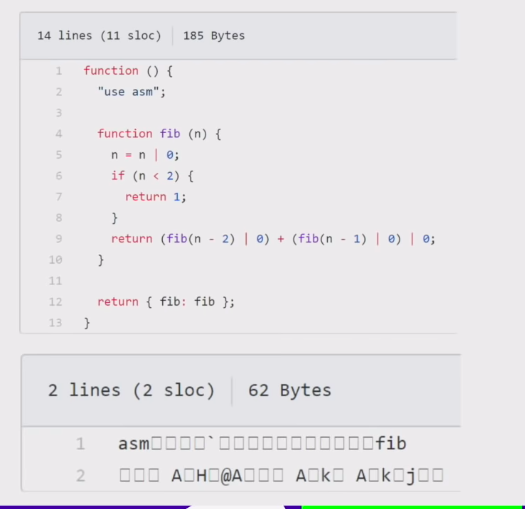

# Rust Intro

<TagLinks />



* System programming languages
  * C, C++, golang
  * used to make drivers and compilers
* Application programming language
  * C#, java, javascript
* No garbage collection
* Package manager - cargo
  * similar to npm, composer ofr php, pip for python
* `rustup` to check language updates
* `ructc` compiler
* `cargo` package manager
* either do compile and run yourself or use cargo
* Built at Mozilla
  * People observed Firefox had security vurnabilities
  * over half of them were due to **memory unsafety**
    * Why? we use C++ wrong
* Language as efficient as C, C++ but not actually dangerous.
* Safety - if you used pointer wrong
  * hackers can steal your bitcoin
* Usenet - twitter over email
* 1995 was an amazing year or porgramming lanaguages, java, javascript, ruby  (1990-91 python)

```bash
# real compiled code
./target/debug/hello-world

# production optimized build
cargo build --release

# build executable
../target/release/hello-world
```

* Web assembly might have replaced docker

<blockquote class="twitter-tweet"><p lang="en" dir="ltr">If WASM+WASI existed in 2008, we wouldn&#39;t have needed to created Docker. That&#39;s how important it is. Webassembly on the server is the future of computing. A standardized system interface was the missing link. Let&#39;s hope WASI is up to the task! <a href="https://t.co/wnXQg4kwa4">https://t.co/wnXQg4kwa4</a></p>&mdash; Solomon Hykes (@solomonstre) <a href="https://twitter.com/solomonstre/status/1111004913222324225?ref_src=twsrc%5Etfw">March 27, 2019</a></blockquote> <script async src="https://platform.twitter.com/widgets.js" charset="utf-8"></script>

* Assembly is dangerous lets make C, which is higher level and easier to use and make less mistakes.
  * Add safety on top, built into programming language
* C++ vs Ruby | Speed vs Safety
* 70% of vurnabilities across all microsoft products are due to memory unsafety
* Higher level languages like node, python, javascript reach out lower level languages for speed. like C, C++

What is a [runtime]?
:   People have

    * C/C++ dont have a [runtime]
    * Languages like ruby, javascript, python have a [runtime]
    * C,C++,rust has small [runtime]

    ::: tip runtime
    Assembly is the only language that do not have a [runtime]

    Stuff that your programming language puts into your programs that you actually didint write.
    :::

* Push the web to limits, everything to all people.
* WASM - making web more ambitious - low level subset of javascript

[runtime]: https://en.wikipedia.org/wiki/Runtime_system

```js
function compiledCalculation () {
  // bitwise OR
  var x = f() | 0;  // 32-bit value
  var y = g() | 0;
  return (x+y) | 0;
}
```

* Use bitwise OR to guarent to use 32-bit integer
  * integers are faster than floats
  * The only types of numbers in javascript are floats
  * Make them faster by explicitly mentioning types.

## Webassembly

* less data over wire
  * pages load faster
* significantly easier to parse - makes webapps faster
* We dont write webassembly by hand, write in other languages than compile them to wasm
* Compile a browser to webassembly?
* [WASI](https://wasi.dev/)


### Going Serverless

* IaaS provide infrastructure api like linux
  * we create an vm and install linux on it. then you do whatever you want.
* PssS provide a language specific api
  * like heroku can host ruby code, provides ruby api

* Webbrowser and very similar to docker
  * they privide api to run code from multiple sources


## Resources

* https://steveklabnik.com/
* https://wasi.dev/


<iframe width="560" height="315" src="https://www.youtube.com/embed/CMB6AlE1QuI" frameborder="0" allow="accelerometer; autoplay; encrypted-media; gyroscope; picture-in-picture" allowfullscreen></iframe>


<iframe width="560" height="315" src="https://www.youtube.com/embed/8QlZbg5B1vk" frameborder="0" allow="accelerometer; autoplay; encrypted-media; gyroscope; picture-in-picture" allowfullscreen></iframe>

<Footer />
